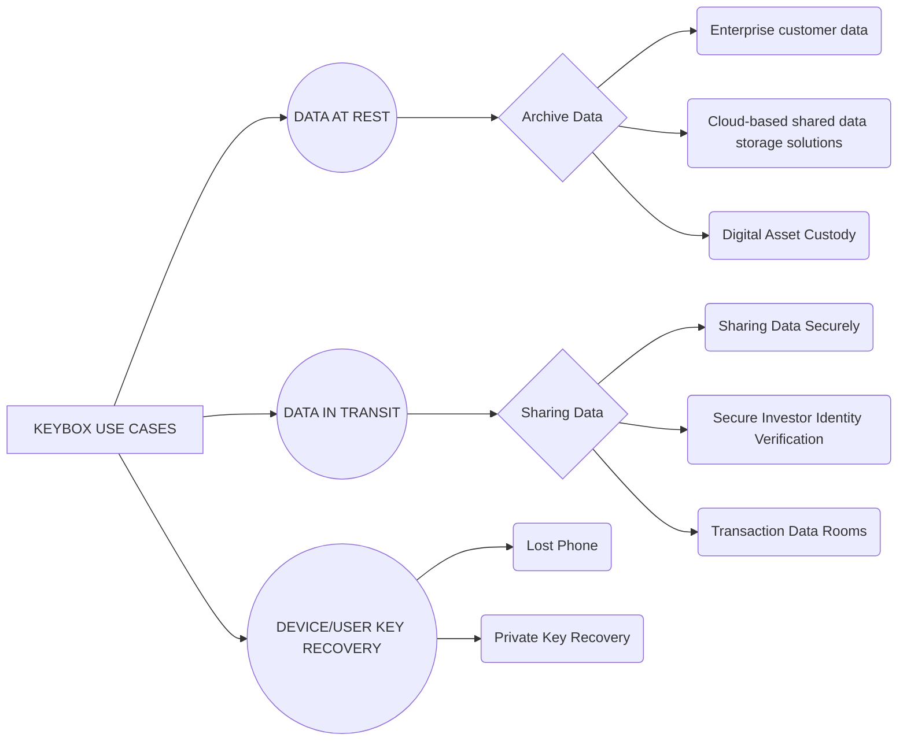

# Keybox White Paper

> An introductory paper to Ethereum, introduced before launch, which is maintained.

Valuable enterprise data is vulnerable to hacks, whether stored in the Cloud or on-premise. Data at rest and data transfers between organisations increase the risk of breaches. Key management and recovery remain an issue and current storage technologies rarely comply with data regulations and privacy laws (e.g. GDPR).

Keybox addresses all of these issues.

>With data fragmentation, Keybox sets the new standard in data management best practice, offering enterprises of all sizes data security, control and traceability


# SECURING DATA WITH KEYBOX


Keybox stores data in encrypted fragments across multiple, decentralised private or public nodes, such that penetrating any node cannot yield any decipherable information. Authorised users recombine data from fragments using smart contract technology.


```

i. Keybox encrypts and fragments data into multiple unique parts

ii. The fragments are distributed across a decentralized network of private or public nodes

iii. Only a subset of the fragments is needed to recreate the whole

iv. The data can only be accessed through the recombination process via smart contracts

v. A redundancy threshold ensures that the failure of a node does not affect the integrity of the data

```


## Tried and tested security algorithms

Keybox uses MIT’s Shamir Secret Sharing to fragment data together with smart contracts to control and monitor data access

## Permissioned blockchain

Keybox leverages a proven, permissioned Blockchain, which has several unique advantages over other distributed ledger protocols, including territoriality and scalability

## Strong focus on usability

The Keybox API and SDK offer enterprises a seamless experience in managing their data at rest or in transit, within their existing data infrastructure


# KEYBOX CLIENTS

 
Enterprises and organisations who wish to store and protect valuable digitised data, in a fully compliant way, whilst retaining low-latency access to their data when required. For example: Financial Services, Professional Services, Healthcare, e-Commerce, Military, Governments.

  

**KEYBOX INTEGRATION**

  

We provide an API and SDK to allow enterprises a seamless experience in managing their data at rest or in transit.

Clients can use their existing infrastructure to host the solution or can use the secure Keybox hosted node

environment.

  

**KEYBOX PRICING**

  

Pricing for the Keybox solution is volume based related to API calls and total storage capacity. Keybox can be

configured to a range of specific requirements, which may include third party node hosting services.

  

  

```

© Keybox Ltd. 2019 All rights reserved. Disclaimer: all data provided is for information purposes only and may not form the basis of any agreement

```

# USE CASES

  

Below are examples of where and how Keybox can be applied: for data at rest; for data in transit or sharing; for

key management and recovery; for compliance and for data theft obstruction.

  

And this will produce a flow chart:

  



  

  

## 1 - DATA AT REST : Protecting Archive Data with Keybox

  

## Example: Enterprise customer data (Cloud-based or on premise)

  

Customer data is stolen every day from enterprises, e.g. hotels. Keybox allows sensitive data to be stored or

backed up in decentralised, secure fragments. The data can be accessed instantly for business logic and may

not even need to be recovered in its entirety to return specific data requests.

  

## Example: Cloud-based shared data storage solutions (e.g. Dropbox)

  

Keybox can sit as a layer between a user and their database, providing an additional security layer to deliver

greater control of access.

  

## Example: Digital Asset Custody

  

Keybox is the safest way to store keys for digital assets that also allows low-latency recovery. Where hot wallets

are not secure and cold storage is slow/inefficient, Keybox provides instant access with highest grade security.

Private keys can be recombined at the point of trade, or for more security, trades executed without fully

recombining the key.

  

## 2 - DATA IN TRANSIT /SHARING : Sharing Data Safely with Keybox

  

## Example: Sharing Data Securely (e.g. file export, Open Banking, Compliance & Audit)

  

Large corporates frequently need auditors or regulators to access and review sensitive information. Banks need

to collaborate with Fintechs. Corporates frequently need to export sensitive data. Keybox can allow authorised

third party access in secure way, with specific, permissioned key access and a full audit trail.

  

## Example: Secure Investor Identity Verification

  

To comply with KYC/AML, investors have to provide highly sensitive documents to complete transactions

(personal details, proof of wealth, residency, address). This data transfer poses a risk. Keybox can allow entities

to share data access exclusively and for a limited time period to specific persons, with low risk.

  

## Example: Transaction Data Rooms

  

To complete corporate transactions, a great deal of sensitive data is stored in data rooms. Access to and transfer

of this data poses a risk. Keybox can allow data sharing for a limited time period to specific entities, with low risk.

  

## 3 - DEVICE/USER KEY RECOVERY : Supporting Lost Access

  

## Example: Lost Phone

  

One of the most common mobile/online support issues is loss of access to a device or an application, caused by

either losing the physical device or the login/password master access. Keybox allows for the automation of the

verification process of an individual's identity, enabling self-certification in applications using a Keybox-powered

network. A user can regain access to their secured data records by controlling the self-certify process for each

record they have created, allowing them to set the challenges themselves for the access recovery for each specific

record or the whole device or account.

  

## 4 - COMPLIANCE WITH GDPR : Proof of Data Territoriality + No Personally Identifiable Data

  

## Example: Demonstrating Auditable GDPR Compliance to Regulators

  

Whilst regulations have evolved and may continue to change, Keybox allows clients to demonstrate adoption of

best practices with regards data security as a data processor through data fragmentation and territoriality.

  

## 5 - DATA THEFT OBSTRUCTION : Protecting Against Stolen Access

  

## Example: Stolen Laptop

  

All data security processes have the challenge of failure at the point of consumption end, e.g. if an open laptop is

stolen. Keybox has functionality to allow new keys to be reissued as soon as an attack is detected – an effective

“freeze” on the account, with authenticated recovery available. Thus, after a first breach, further damage is limited.

  

## 6 - KEY MANAGEMENT : Access Control

  

## Example: Crypto Currency Exchanges

  

Keybox can secure private keys with permissions over access control. Crypto exchanges request you send your

crypto keys to their wallet. Keybox allows you to give the exchange permission to access your private key only

under certain conditions to generate the signature needed for them to transact for you on a public network.

  

## TO GAIN ACCESS TO THE KEYBOX API, PLEASE CONTACT: FRANCESCO ANDREOLI FRANCESCO@KEYBOX.CO

  

## GENERAL ENQUIRIES: INFO@KEYBOX.CO

```
© Keybox Ltd. 2019 All rights reserved. 
```
```
Disclaimer: all data provided is for information purposes only and may not form the basis of any agreement
```
  


<!--stackedit_data:
eyJoaXN0b3J5IjpbLTE1NDIwNDQ4MDgsNDA4NjIwNTQsLTEzMz
IyNDA3NSwtMTcxMjY1NzY2OCwtMTAxMDAzMzUzMywtMTMxMTM3
NzE4OSwxMjA3MTk4MTk0XX0=
-->