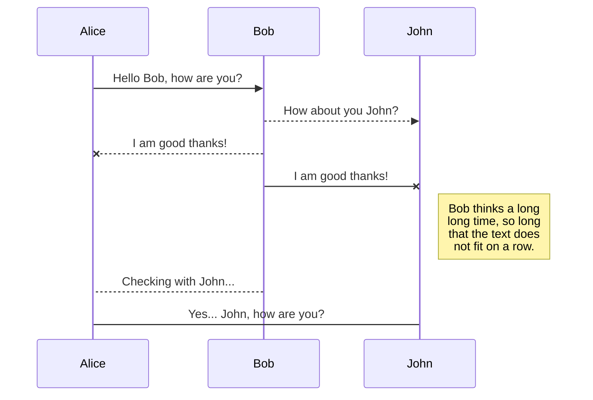
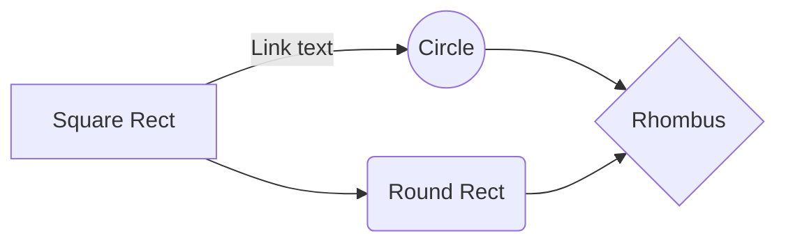
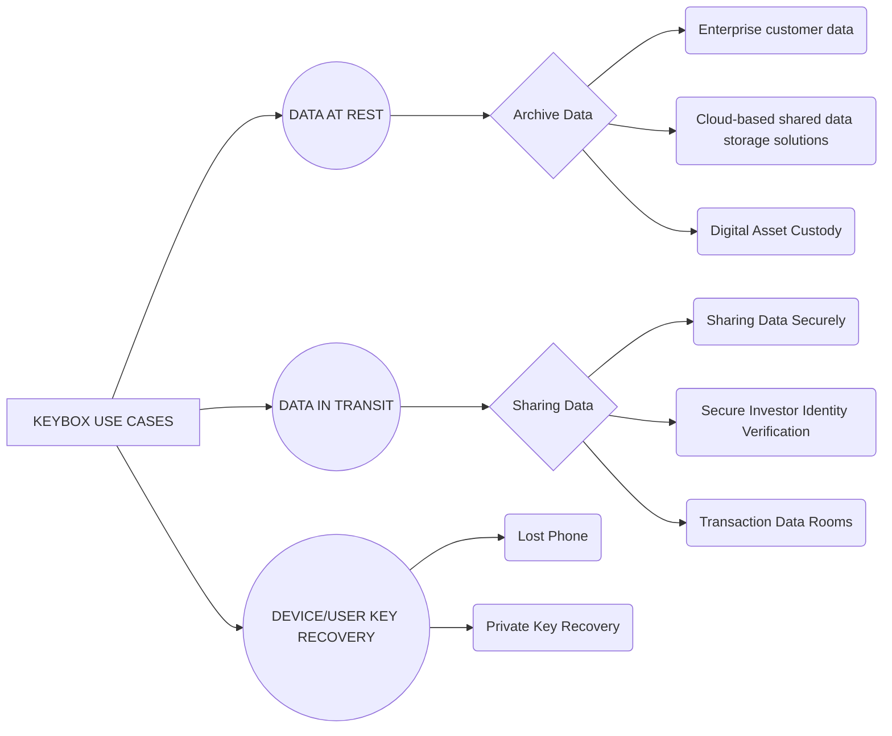

# Welcome to StackEdit!

Hi! I'm your first Markdown file in **StackEdit**. If you want to learn about StackEdit, you can read me. If you want to play with Markdown, you can edit me. Once you have finished with me, you can create new files by opening the **file explorer** on the left corner of the navigation bar.


# Files

StackEdit stores your files in your browser, which means all your files are automatically saved locally and are accessible **offline!**

## Create files and folders

The file explorer is accessible using the button in left corner of the navigation bar. You can create a new file by clicking the **New file** button in the file explorer. You can also create folders by clicking the **New folder** button.

## Switch to another file

All your files and folders are presented as a tree in the file explorer. You can switch from one to another by clicking a file in the tree.

## Rename a file

You can rename the current file by clicking the file name in the navigation bar or by clicking the **Rename** button in the file explorer.

## Delete a file

You can delete the current file by clicking the **Remove** button in the file explorer. The file will be moved into the **Trash** folder and automatically deleted after 7 days of inactivity.

## Export a file

You can export the current file by clicking **Export to disk** in the menu. You can choose to export the file as plain Markdown, as HTML using a Handlebars template or as a PDF.


# Synchronization

Synchronization is one of the biggest features of StackEdit. It enables you to synchronize any file in your workspace with other files stored in your **Google Drive**, your **Dropbox** and your **GitHub** accounts. This allows you to keep writing on other devices, collaborate with people you share the file with, integrate easily into your workflow... The synchronization mechanism takes place every minute in the background, downloading, merging, and uploading file modifications.

There are two types of synchronization and they can complement each other:

- The workspace synchronization will sync all your files, folders and settings automatically. This will allow you to fetch your workspace on any other device.
	> To start syncing your workspace, just sign in with Google in the menu.

- The file synchronization will keep one file of the workspace synced with one or multiple files in **Google Drive**, **Dropbox** or **GitHub**.
	> Before starting to sync files, you must link an account in the **Synchronize** sub-menu.

## Open a file

You can open a file from **Google Drive**, **Dropbox** or **GitHub** by opening the **Synchronize** sub-menu and clicking **Open from**. Once opened in the workspace, any modification in the file will be automatically synced.

## Save a file

You can save any file of the workspace to **Google Drive**, **Dropbox** or **GitHub** by opening the **Synchronize** sub-menu and clicking **Save on**. Even if a file in the workspace is already synced, you can save it to another location. StackEdit can sync one file with multiple locations and accounts.

## Synchronize a file

Once your file is linked to a synchronized location, StackEdit will periodically synchronize it by downloading/uploading any modification. A merge will be performed if necessary and conflicts will be resolved.

If you just have modified your file and you want to force syncing, click the **Synchronize now** button in the navigation bar.

> **Note:** The **Synchronize now** button is disabled if you have no file to synchronize.

## Manage file synchronization

Since one file can be synced with multiple locations, you can list and manage synchronized locations by clicking **File synchronization** in the **Synchronize** sub-menu. This allows you to list and remove synchronized locations that are linked to your file.


# Publication

Publishing in StackEdit makes it simple for you to publish online your files. Once you're happy with a file, you can publish it to different hosting platforms like **Blogger**, **Dropbox**, **Gist**, **GitHub**, **Google Drive**, **WordPress** and **Zendesk**. With [Handlebars templates](http://handlebarsjs.com/), you have full control over what you export.

> Before starting to publish, you must link an account in the **Publish** sub-menu.

## Publish a File

You can publish your file by opening the **Publish** sub-menu and by clicking **Publish to**. For some locations, you can choose between the following formats:

- Markdown: publish the Markdown text on a website that can interpret it (**GitHub** for instance),
- HTML: publish the file converted to HTML via a Handlebars template (on a blog for example).

## Update a publication

After publishing, StackEdit keeps your file linked to that publication which makes it easy for you to re-publish it. Once you have modified your file and you want to update your publication, click on the **Publish now** button in the navigation bar.

> **Note:** The **Publish now** button is disabled if your file has not been published yet.

## Manage file publication

Since one file can be published to multiple locations, you can list and manage publish locations by clicking **File publication** in the **Publish** sub-menu. This allows you to list and remove publication locations that are linked to your file.


# Markdown extensions

StackEdit extends the standard Markdown syntax by adding extra **Markdown extensions**, providing you with some nice features.

> **ProTip:** You can disable any **Markdown extension** in the **File properties** dialog.


## SmartyPants

SmartyPants converts ASCII punctuation characters into "smart" typographic punctuation HTML entities. For example:

|                |ASCII                          |HTML                         |
|----------------|-------------------------------|-----------------------------|
|Single backticks|`'Isn't this fun?'`            |'Isn't this fun?'            |
|Quotes          |`"Isn't this fun?"`            |"Isn't this fun?"            |
|Dashes          |`-- is en-dash, --- is em-dash`|-- is en-dash, --- is em-dash|


## KaTeX

You can render LaTeX mathematical expressions using [KaTeX](https://khan.github.io/KaTeX/):

The *Gamma function* satisfying $\Gamma(n) = (n-1)!\quad\forall n\in\mathbb N$ is via the Euler integral

$$
\Gamma(z) = \int_0^\infty t^{z-1}e^{-t}dt\,.
$$

> You can find more information about **LaTeX** mathematical expressions [here](http://meta.math.stackexchange.com/questions/5020/mathjax-basic-tutorial-and-quick-reference).


## UML diagrams

You can render UML diagrams using [Mermaid](https://mermaidjs.github.io/). For example, this will produce a sequence diagram:



And this will produce a flow chart:




```
© Keybox Ltd. 2019 All rights reserved. Disclaimer: all data provided is for information purposes only and may not form the basis of any agreement
```
Valuable enterprise data is vulnerable to hacks, whether stored in the Cloud or on-premise. Data at rest and
data transfers between organisations increase the risk of breaches. Key management and recovery remain an
issue and current storage technologies rarely comply with data regulations and privacy laws (e.g. GDPR).
Keybox addresses all of these issues.

## With data fragmentation, Keybox sets the new standard in data management best

## practice, offering enterprises of all sizes data security, control and traceability

### SECURING DATA WITH KEYBOX

Keybox stores data in encrypted fragments across multiple, decentralised private or public nodes, such that
penetrating any node cannot yield any decipherable information. Authorised users recombine data from fragments
using smart contract technology.

```
i. Keybox encrypts and fragments data into multiple unique parts
ii. The fragments are distributed across a decentralized network of private or public nodes
iii. Only a subset of the fragments is needed to recreate the whole
iv. The data can only be accessed through the recombination process via smart contracts
v. A redundancy threshold ensures that the failure of a node does not affect the integrity of the data
```
```
Tried and tested security algorithms
Keybox uses MIT’s Shamir Secret Sharing to fragment data together with smart
contracts to control and monitor data access
```
```
Permissioned blockchain
Keybox leverages a proven, permissioned Blockchain, which has several unique
advantages over other distributed ledger protocols, including territoriality and scalability
```
```
Strong focus on usability
The Keybox API and SDK offer enterprises a seamless experience in managing their
data at rest or in transit, within their existing data infrastructure
```
### KEYBOX CLIENTS

Enterprises and organisations who wish to store and protect valuable digitised data, in a fully compliant way,
whilst retaining low-latency access to their data when required. For example: Financial Services, Professional
Services, Healthcare, e-Commerce, Military, Governments.

**KEYBOX INTEGRATION**

We provide an API and SDK to allow enterprises a seamless experience in managing their data at rest or in transit.
Clients can use their existing infrastructure to host the solution or can use the secure Keybox hosted node
environment.

**KEYBOX PRICING**

Pricing for the Keybox solution is volume based related to API calls and total storage capacity. Keybox can be
configured to a range of specific requirements, which may include third party node hosting services.


```
© Keybox Ltd. 2019 All rights reserved. Disclaimer: all data provided is for information purposes only and may not form the basis of any agreement
```
# USE CASES

Below are examples of where and how Keybox can be applied: for data at rest; for data in transit or sharing; for
key management and recovery; for compliance and for data theft obstruction.

And this will produce a flow chart:




## 1 - DATA AT REST : Protecting Archive Data with Keybox

## Example: Enterprise customer data (Cloud-based or on premise)

Customer data is stolen every day from enterprises, e.g. hotels. Keybox allows sensitive data to be stored or
backed up in decentralised, secure fragments. The data can be accessed instantly for business logic and may
not even need to be recovered in its entirety to return specific data requests.

## Example: Cloud-based shared data storage solutions (e.g. Dropbox)

Keybox can sit as a layer between a user and their database, providing an additional security layer to deliver
greater control of access.

## Example: Digital Asset Custody

Keybox is the safest way to store keys for digital assets that also allows low-latency recovery. Where hot wallets
are not secure and cold storage is slow/inefficient, Keybox provides instant access with highest grade security.
Private keys can be recombined at the point of trade, or for more security, trades executed without fully
recombining the key.

## 2 - DATA IN TRANSIT /SHARING : Sharing Data Safely with Keybox

## Example: Sharing Data Securely (e.g. file export, Open Banking, Compliance & Audit)

Large corporates frequently need auditors or regulators to access and review sensitive information. Banks need
to collaborate with Fintechs. Corporates frequently need to export sensitive data. Keybox can allow authorised
third party access in secure way, with specific, permissioned key access and a full audit trail.

## Example: Secure Investor Identity Verification

To comply with KYC/AML, investors have to provide highly sensitive documents to complete transactions
(personal details, proof of wealth, residency, address). This data transfer poses a risk. Keybox can allow entities
to share data access exclusively and for a limited time period to specific persons, with low risk.

## Example: Transaction Data Rooms

To complete corporate transactions, a great deal of sensitive data is stored in data rooms. Access to and transfer
of this data poses a risk. Keybox can allow data sharing for a limited time period to specific entities, with low risk.

## 3 - DEVICE/USER KEY RECOVERY : Supporting Lost Access

## Example: Lost Phone

One of the most common mobile/online support issues is loss of access to a device or an application, caused by
either losing the physical device or the login/password master access. Keybox allows for the automation of the
verification process of an individual's identity, enabling self-certification in applications using a Keybox-powered
network. A user can regain access to their secured data records by controlling the self-certify process for each
record they have created, allowing them to set the challenges themselves for the access recovery for each specific
record or the whole device or account.

## 4 - COMPLIANCE WITH GDPR : Proof of Data Territoriality + No Personally Identifiable Data

## Example: Demonstrating Auditable GDPR Compliance to Regulators

Whilst regulations have evolved and may continue to change, Keybox allows clients to demonstrate adoption of
best practices with regards data security as a data processor through data fragmentation and territoriality.

## 5 - DATA THEFT OBSTRUCTION : Protecting Against Stolen Access

## Example: Stolen Laptop

All data security processes have the challenge of failure at the point of consumption end, e.g. if an open laptop is
stolen. Keybox has functionality to allow new keys to be reissued as soon as an attack is detected – an effective
“freeze” on the account, with authenticated recovery available. Thus, after a first breach, further damage is limited.

## 6 - KEY MANAGEMENT : Access Control

## Example: Crypto Currency Exchanges

Keybox can secure private keys with permissions over access control. Crypto exchanges request you send your
crypto keys to their wallet. Keybox allows you to give the exchange permission to access your private key only
under certain conditions to generate the signature needed for them to transact for you on a public network.

## TO GAIN ACCESS TO THE KEYBOX API, PLEASE CONTACT: FRANCESCO ANDREOLI FRANCESCO@KEYBOX.CO

## GENERAL ENQUIRIES: INFO@KEYBOX.CO


<!--stackedit_data:
eyJoaXN0b3J5IjpbLTEzODM5NDgwMjldfQ==
-->